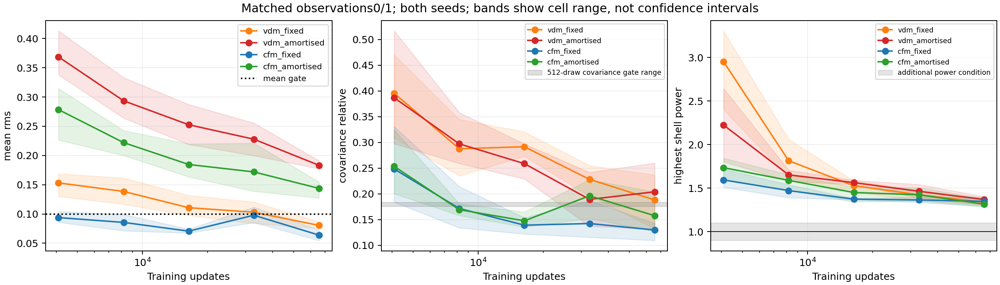

# Gaussian reference continuation: scientific conclusions

Complete: all12fits reached65536updates, all240checkpoint ensembles and24final
precision ensembles are present. **4096updates were materially under-trained,
but this16-fold continuation does not establish a fully accurate field posterior.**
Fixed CFM now passes all four original endpoint diagnostics across both seeds and
both matched observations; persistent fine-scale power error and amortised mean
bias prevent promotion. This narrows the failure rather than establishing that
the models cannot learn covariance.

[Complete measurements and receipts](evidence/e2e_conditional_reference_continuation_20260920/README.md)
include every registered cell, training logs, replay controls, source/parent hashes,
and612generated-artifact hashes. All264draw arrays are shape-checked and finite;
all12final checkpoints have65536Adam steps, unchanged learning rate and verified
ancestry. All23focused tests pass. Slurm58597933 completed0:0 in1h11m59s; the
scientific step took1h06m51s. The allocation is released; no other allocation is
active. The scientific run tree is0.567GiB. No affine, nonlinear, Abacus or P12
training was launched.

## Question and controlled comparison

Were the earlier learned-posterior errors simply consequences of stopping at
4096updates? All12original fits are continued to65536updates: VDM/CFM, seeds17/29,
amortised conditional learning and fixed-observation fits for cases0/1. Training
law, model, learning rate, batch size, normalization, fresh-data generator and
Adam/RNG checkpoint state are retained. This is16times the original final update,
not a different model trained from scratch. Additional fresh examples accompany
additional optimization, so the experiment does not separate these two exposures.

The [registered protocol](e2e_conditional_reference_continuation_v1.md) evaluates
4096/8192/16384/32768/65536with512draws each, at VDM512/1024NFE and CFM128/256NFE.
The65536endpoints additionally receive2048draws at the higher NFE. Comparisons of
training progress use a fixed NFE and draw count; the larger final ensembles are
an additional precision check, not a substitute baseline. The old VDM256NFE
numbers must not be compared directly to new1024NFE numbers as a training effect.

Matched comparisons use both seeds and observations0/1. Amortised-only cases2/3
remain in the evaluation panel. There is no best-checkpoint or best-seed selection.
Fixed fits receive exact posterior draws for one observation and less
between-observation diversity. This is an idealized diagnostic, not an equal-
information control or a practical replacement for DESI conditional inference.

## What interrupted the first attempt

Allocation58596902 stopped after17seconds in a GPU replay check, before any
continuation training. On the instrumented retry, the restored model, Adam state,
random training data and loss matched exactly; default GPU backward/update
arithmetic differed by approximately1.2e-5--6.8e-5 in parameters. All12fits replay
exactly when deterministic algorithms are enabled for that technical control.
The cause was arithmetic nondeterminism, not a corrupt checkpoint or changed
training data. The equality tolerance was not relaxed.

The user then explicitly removed the budget blocker and asked to complete the
task. Allocation58597933 on nid008217 ran under tmux on login31, with a two-hour
scheduler bound. Scientific training retains the parent's default backend and
unchanged settings. Consequently the checkpoint state is restored exactly, but
bitwise-identical default-backend training trajectories are not promised. The
original4096run and the first failed snapshot are immutable.

## Diagnostic meaning and limitations

Mean RMS error is normalized by the exact posterior RMS. Covariance error is a
relative Frobenius error on16registered spatial projections, including octants
and low Fourier modes: it does not certify all512field dimensions. Octant coverage
is exact Gaussian posterior probability inside sample-derived intervals, not
population TARP coverage across many independent survey realizations. Power is
posterior residual power about each ensemble's own mean, not total field power.

The original four gates retain their original meaning. The prospectively declared
additional power condition requires every final toy shell to lie in[0.9,1.1]. A
pass on the selected covariance probes and a failure of that power condition are
not contradictory. No threshold has been adjusted in response to these results.
These toy tolerances are not established DESI science requirements.
The registered reproducibility condition requires both matched observations and
both seeds to pass at32768and65536, as well as the final precision check; final
endpoint success alone must be reported separately. A conditional learner also
has to pass its additional observations2/3.

## Two inexpensive analytic checks

**Finite-sample power scatter.** The highest shell contains13Fourier modes. For
Gaussian draws, its unbiased sample-covariance power follows a weighted sum of
independent chi-squares, with2047degrees of freedom per eigenvalue at2048draws.
The weights are eigenvalues of the exact posterior covariance projected into the
conjugate-closed shell, accounting for the masks and spatially varying noise.
The resulting central99%reference interval is approximately[0.9776,1.0225] for
both templates (20000reference replicates; relative standard deviation0.00876).
The implementation is checked against the isotropic closed-form chi-square law.
This is explanatory uncertainty quantification, not a new acceptance gate.

**CFM irreducible target loss.** For the independent linear bridge
`z=(1-t)*epsilon+t*x`, the conditional velocity target variance in a posterior
covariance eigenmode with eigenvalue lambda is
`lambda/((1-t)^2+t^2*lambda)`. Integrating over uniform time gives
`(pi/2)*sqrt(lambda)`; average over eigenmodes for the per-voxel loss floor.
The two template floors are0.8020309542and0.8041508265; the amortised mixture floor
is their mean. Independent numerical quadrature agrees to1.2e-16.

Thus a total CFM training loss near0.810 is dominated by unavoidable stochastic
target variance, even while meaningful systematic errors remain. This is a
decomposition of expected squared loss, NOT a measurement that99%of the gradient
variance is noise. The final online loss averages1024minibatches while parameters
change; its difference from the analytic floor is an approximate excess-risk
diagnostic, not a frozen validation estimate.

Exact conditional-mean velocity supervision removes this irreducible target
variance without changing the population squared-loss minimizer. It is therefore
a useful next diagnostic when paired with the same U-Net and a Gaussian-capable
affine learned control. That oracle target is available for this reference only,
not for DESI. A late plateau under a constant learning rate alone cannot prove
that the U-Net lacks representational capacity.

## Final results and determination

### Matched learning curves at identical sampling settings

Averages across cases0/1 and both seeds, using512draws throughout: VDM1024NFE
and CFM256NFE. Arrows denote4096to65536updates.

| Model | Mean RMS error | Probe-covariance error | Highest-shell power ratio |
|---|---:|---:|---:|
| VDM fixed |0.1532 → 0.0805|0.3955 → 0.1883|2.9519 → 1.3382|
| VDM amortised |0.3686 → 0.1833|0.3869 → 0.2041|2.2241 → 1.3695|
| CFM fixed |0.0938 → 0.0640|0.2483 → 0.1299|1.5942 → 1.3487|
| CFM amortised |0.2784 → 0.1438|0.2535 → 0.1577|1.7348 → 1.3172|

Amortised mean errors fall by about50.3%(VDM) and48.4%(CFM). Fixed-CFM covariance
error falls into the512-draw sampling-floor range. The4096errors were not evidence
of an immutable covariance representation limit; the earlier report explicitly
left this learning-curve question unresolved.

### Final precision check:2048draws, same high NFE

| Model | Mean RMS | Covariance error | Voxel variance ratio | Octant coverage | Original four-gate pass |
|---|---:|---:|---:|---:|---:|
| VDM fixed |0.0751|0.1453|0.9758|0.8957|2/4|
| VDM amortised |0.1814|0.1597|0.9705|0.8925|0/4|
| CFM fixed |0.0519|0.0674|1.0021|0.9018|4/4|
| CFM amortised |0.1402|0.0973|1.0115|0.8893|0/4|

The smaller covariance estimates than at512draws are not further learning: the
model is identical and the Monte Carlo floor is smaller. All eight amortised
observation/seed cells fail the mean gate for both objectives. CFM amortised
covariance/variance/coverage checks pass. VDM fixed fails covariance on case0in
both seeds. These distinctions are lost in an averaged pass/fail label.

The strict across-checkpoint gate passes in **none** of the four configurations.
Fixed CFM passes4/4at16384, only1/4at32768, then4/4at65536and in the precision
check. This is not monotone, stable qualification under the unchanged constant
learning rate. Final endpoint success is nevertheless a genuine result.

### What remains wrong

Every matched final precision cell fails the extra all-shell power condition.
Highest-shell ratios are1.327–1.361(VDM fixed),1.357–1.410(VDM amortised),
1.333–1.415(CFM fixed), and1.304–1.362(CFM amortised): approximately30–42%excess
uncertainty power, compared with an exact-ensemble99%null of about±2.25%.
The additional amortised observations do not cure this problem.

Fixed CFM's averaged highest-shell ratio moves1.374 → 1.364 → 1.349over
16384 → 32768 → 65536updates: much slower improvement than the early curve,
despite more than one million additional fresh examples per fit. Amortised means
still improve appreciably from32768to65536(roughly20%VDM/16%CFM). Therefore
**we have not proved an asymptote or ruled out further training gains**. What is
established is that this substantial continuation does not resolve the remaining
errors. Either 'just under-training' or 'architecture incapable' would overstate
the evidence.

Doubling CFM128to256NFE changes final mean/covariance errors by only about
1e-5/1e-4to2e-4on average, and changes any shell power ratio by less than0.0008
across all final cells. It cannot explain the spectral discrepancy. VDM512to1024
changes average voxel variance ratios by about0.015, with additional finite-
ensemble scatter from different stochastic paths. Exact-oracle covariance floors
remain2.55%and1.29%. Do not subtract oracle full-covariance norms from learned
16-probe errors or interpret stochastic NFE differences as pure solver bias.

### Next decision

Keep the large coupled Abacus campaign and nonlinear rung gated; preserve the
prepared data and P12's production role. The next informative control remains
CFM exact-conditional-target supervision paired with the same U-Net and a
Gaussian-capable affine learned baseline, measured learning curves, and separate
mean/covariance/power checks. This separates noisy-target optimization from
parameterization more cleanly than another blind doubling. An affine control
alone would not isolate the cause: the same-U-Net teacher comparison is needed.
Learning-rate effects remain possible under the constant-step recipe.

Amortisation remains a measurable mean-learning burden, not a demonstrated
fundamental obstacle. Covariance improves greatly even for the conditional model,
while high-frequency error survives without the conditioning-map burden. CFM is
the cleaner next diagnostic instrument here, not a generally established winner
over VDM for nonlinear DESI-conditioned matter fields. No follow-on scientific
training is silently included in this closeout.
