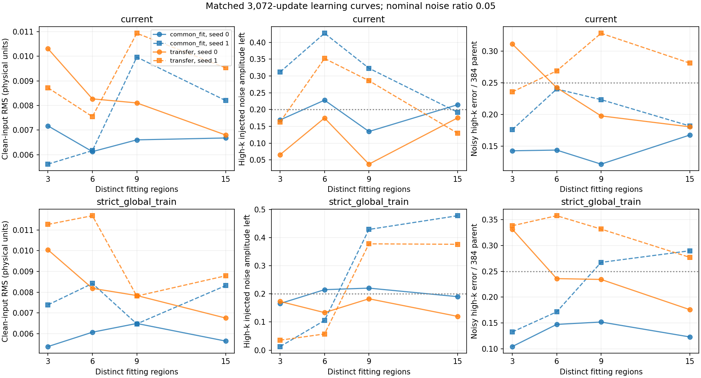
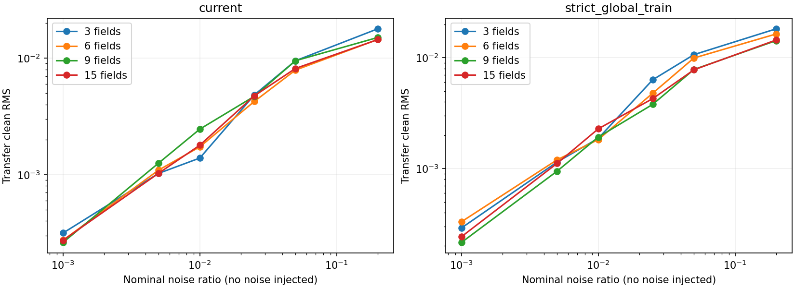
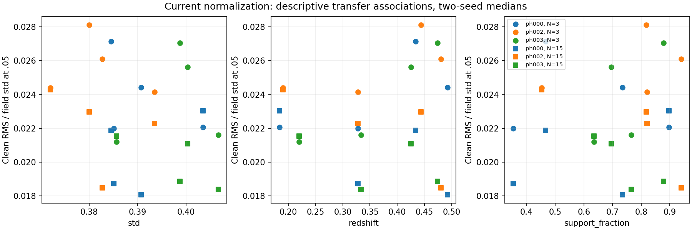

# Diversity and global normalization isolation

## Completed result

Allocation58373492 completed successfully and was released after1h23m08s.
All five application steps exited0:0; zero allocations remain. Sixteen fits,
49,152 updates,32 checkpoints,16,038 clean/noisy probes and135 compensated
roundtrip comparisons completed. Fourteen unit tests and full-size gradient
smokes pass. The tiny/current seed-zero model reproduces the prior checkpoint
EXACTLY, including the expanded-panel predictions. Original parents, source
products and canonical normalization remain unchanged. No E2E training resumed.

### Learning curve and normalization matrix

Each entry is **clean-input RMS / high-k noise-correlated amplitude left** at
nominal ratio .05. RMS is in physical fine-residual units. Summaries are medians
over12 fixed transfer regions within each model, then across two seeds; they are
not confidence intervals. Both seeds, common fitted-three curves, exposed-field
curves, .2 results, spectral errors/gains and paired field effects are retained in
[the evidence](evidence/e2e_field_v2/diversity_norm_20260915/RESULTS.md).

| Distinct fitting regions | Current global scaler | Fixed strict training-only scaler |
|---:|---:|---:|
| 3 | .009512 / 11.45% | .010652 / 10.43% |
| 6 | .007908 / 26.34% | .009935 / 9.55% |
| 9 | .009518 / 16.17% | .007828 / 28.01% |
| 15 | .008167 / 15.24% | .007774 / 24.80% |

Increasing3->15 fields reduces the summary clean RMS by14.1% under current
scaling and27.0% under strict scaling, **not a collapse**. Paired, within-field
clean RMS ratios are .648 and1.072 for current scaling's two seeds (12/12 and3/12
transfer regions improve), versus .675 and .774 for strict scaling (12/12 improve
in each). Thus diversity helps more consistently in the strict column, but is
not a robust standalone cure; noise removal also changes and must be checked.
The nine-field and fifteen-field points do not establish a sensible asymptote.

At15 fields, strict versus current scaling changes paired clean RMS by about
0% and-7.7% in the two seeds. The second seed simultaneously increases noise
leakage by .248 in absolute amplitude and increases noisy high-k error by11.7%.
A slightly cleaner input-preservation metric is not sufficient denoising success.

The strongest cell (15 fields, strict scaler, seed0) passes all12 transfer .05
checks, but only12/15 exposed fitted fields; the original fittedph000 anchor
still leaves .233 noise amplitude (> .2 gate). Its paired seed passes0/12
transfer and0/15 fitted .05 checks. No cell passes every exposed-fitting and
transfer check at both .05 and .2. Do not promote one favorable seed.

### What the normalization controls isolate

The current normalizer was already global, not per-field. The strict target
standard deviation changes only0.225%; conditioning shifts are larger. With
the exact same frozen weights and fields, current -> strict global changes
transfer clean RMS .0103055 -> .0101062 (1.93% improvement); target-only gives
.0102590 (0.45%), conditions-only .0101557 (1.45%). None removes the distortion.
The tiny-three-field scaler raises frozen clean RMS to .0550328, a5.34x increase.
This is a mismatched-scaler sensitivity test, not evidence about a model retrained
with tiny-only scaling. A properly compensated change of coordinates preserves
the frozen physical predictor to max3.34e-6 normalized units. Pure changes of
units cannot themselves fix a fixed physical function.

### Clean limit and field-statistics associations

At exactly sigma0, every field is unchanged by construction. This is a passing
implementation check, not evidence that identity was learned. With zero injected
noise and nominal sigma .001, the four15-field models still have transfer clean
RMS .000232--.000313, about .60--.81 of that nominal physical noise amplitude.
At .05 their transfer RMS is .00676--.00953, about1.7--2.45% of field standard
deviation. Common fitted fields also retain RMS .00565--.00832: the problem is
not exclusive to unseen fields. Positive-noise identity is a diagnostic, not a
mathematical requirement for an optimal conditional denoiser.

The .001/.005/.01 probes extrapolate below the trained minimum noise ratio .025.
The residual path guarantees identity at zero but does not by itself constrain
how quickly the learned correction vanishes nearby. Extra fields or more updates
under the unchanged schedule do not directly add exposure to this missing regime.

At15 fields, field-relative distortion has weak fine-mean rank correlations
(-.19 to .13), moderate negative fine-std correlations (-.50 to -.18), and
stronger but seed-dependent redshift/selection associations. For current scaling,
redshift Spearman rho is -.832/-.357 (within-phase Pearson -.908/-.281), while
observed support rho is .063/.552. After within-phase centering, fine-std Pearson
is only -.138/-.084 in those two runs. The original tiny model instead showed
positive redshift associations. There is no stable mean/variance signature that
uniquely implicates global scaling. These twelve correlated development regions
support descriptive diagnostics, not causal claims or significance tests.

### Decision and next isolating controls

Keep full E2E paused. Neither insufficient regional diversity alone nor the
tested global numerical scaling is established as the dominant cause. Internal
GroupNorm, conditioning/domain shift, optimization and the near-zero residual
parameterization remain unisolated. This study holds architecture/GroupNorm fixed
and keeps the NGC->SGC split; it does not test new independent simulation phases.

No convergence claim:15-field noisy high-k error falls by47--69% from1,536 to
3,072 updates, yet one current-scaler seed's clean RMS worsens by about3% while
its noisy error improves. Gradient clipping remains frequent (about95--96% at15
fields). With fixed updates, each field receives roughly205 rather than1,024
presentations. A flat/noisy field-count curve is not an optimization asymptote.

Next controls should (1) establish a fixed15-field optimization curve with both
seeds and separate clean/noisy stop criteria; (2) isolate selection/conditioning
shift using a matched-support/redshift/cap split at fixed field count; and
(3) test the near-zero boundary/noise coverage separately from field diversity.
Changing internal normalization would be a separate paired architecture test,
not a conclusion from this global-scaler experiment. These follow-ons have NOT
been launched; no automatic extension, held-out opening or E2E restart.

Evidence: `docs/evidence/e2e_field_v2/diversity_norm_20260915/` contains the full
summary, plots and scheduler/provenance receipt. Registered implementationc785ed9;
reporting/paired analysis86caba7. Registration below records the original design.

Registered 2026-09-15 before fitting; user approves CPU/GPU compute. Full E2E
and held-out phases remain paused. Allocation 58373492: two GPUs, two hours.

## Matched matrix

Near-identity FiLM U-Net, unchanged internal GroupNorm, tau .05, AdamW,
learning rate 1e-4, clipping 1, 3,072 updates, original continuous multi-noise
exposure including the pure-noise endpoint. Fresh fits at 3, 6, 9, 15 regions
times current / strict-global-train normalization, two training seeds: 16 fits,
49,152 updates. Evaluate at 0, 1,536, 3,072; preserve 32 checkpoints. Noise
tensors and physical noise/time exposure are paired across cells. Field/bin
scheduling avoids phase or field aliasing with the six noise bins. Presentations
per field decrease with diversity at this fixed update budget.

Three training phases (000/002/003), not independent new cosmologies. Metadata-only
selection retains the original three NGC fitted anchors and expands to 15 mutually
non-overlapping stored source footprints. Twelve SGC transfer anchors (four shells
per phase) have no stored source-footprint overlap with any training anchor.
Transfer regions can overlap each other; coarse conditioning domains can overlap.
This uses the existing source-coordinate mapping, not an independent audit of it.
Increasing diversity also changes environment/redshift/selection coverage.

## Numerical scale control

Current normalization is already global, fitted on all 96 training-role cutouts,
including these development transfer regions. Strict normalization uses only the
largest 15-region fitting partition and is FIXED across all four diversity levels.
The tiny strict fit therefore uses moments from additional eligible training
fields, but no transfer moments. Identity condition channels and nonlinear
transforms remain unchanged. Internal activation GroupNorm is NOT changed.

New module's endpoint-safe affine VP chart preserves the exact physical corrupted
field and original physical velocity objective, including both endpoints. Changing
target units must not silently change the physical denoising problem or loss.
Frozen original 3,072-update weights are evaluated with current, strict, tiny-only,
strict-target-only and strict-condition-only scalers. Direct swaps are sensitivity
interventions, not equivalent predictors or proof that new scaling is correct.
An inverse/forward compensated chart must preserve the frozen physical function.
Replica-zero tiny/current fit must replay the previous checkpoint to numerical
tolerance, a separate implementation and control-fidelity check.

## Outcomes and interpretation

Zero injected noise at nominal ratios 0, .001, .005, .01, .025, .05, .2;
two paired noise realizations at .05 and .2 on the fixed 27-region panel.
Clean VP input is a*y, corresponding to a clean input in the VE denoiser chart.
Exactly zero identity is algebraically forced and is NOT learned evidence.
At positive nominal noise, clean distortion is a diagnostic rather than a demand
that the optimal finite-noise conditional estimator be exactly identity.

Report physical clean RMS/bias/max error and spectral gains/error separately
from injected-noise leakage and physical noisy error. Preserve four spectral bands
and compare against the frozen 384 parent on the same panel/noise realizations.
Report common fitted-three, exposed fitted subset, unused eligible training fields,
and fixed transfer-twelve separately; do not confuse changing fitted-set medians
with a matched learning curve. Show both optimization checkpoints and seed spread.

Explore clean-distortion associations with field mean/std, skew/tails, density
distribution, redshift, support/selection and counts, including within-phase
centering. These are descriptive, correlated, small-sample comparisons, not causal
tests or independent-field confidence intervals. A decreasing transfer curve with
stable fitted performance supports coverage; a paired normalization benefit
supports scale sensitivity. Neither guarantees an asymptote at fifteen regions or
convergence at 3,072 updates. Mixed outcomes remain possible. No production or
posterior-calibration promotion follows from these capability diagnostics.

Implementation: `workflows/sbi/e2e_diversity_norm.py`; frozen settings:
`configs/e2e_diversity_norm_20260915.json`; tiny algebra/scheduling tests:
`tests/test_e2e_diversity_norm.py`. Full-size forward/backward smoke precedes fitting.
Output root: `/pscratch/sd/d/dkololgi/abacus/e2e_field_v2/wide_pipeline_v1/diversity_norm_20260915_58373492`.

## Physical equivalence of normalization charts

Write the original normalized target as y, corrupted state as x=a*y+b*epsilon,
and the new target as y'=(y-m)/s. Define q=sqrt(s²*a²+b²). The new network sees
x'=(x-a*m)/q with a'=s*a/q and b'=b/q, so exactly the same physical noise
realization is used. Its time is t'=2*atan2(b,s*a)/pi. Convert its velocity back:

`v = a*b*(1-s²)*x/q² - b*m/q² + (s/q)*v'`.

This avoids division by a or b and remains finite at clean and pure-noise
endpoints. The original physical velocity loss is evaluated AFTER conversion.
Changing numerical units therefore does not change the corrupted physical field
or objective. It does change what the raw network sees and how its parameters
optimize, which is the intended intervention. Applying a matching inverse chart
inside a frozen model instead must preserve its complete physical function.

The measured pooled strict target mean/scale in original normalized units are
0.0011421151 and 0.9977481911. Thus the fine-target scale changes by only0.225%.
Conditioning changes are larger and remain a separately tested component.
