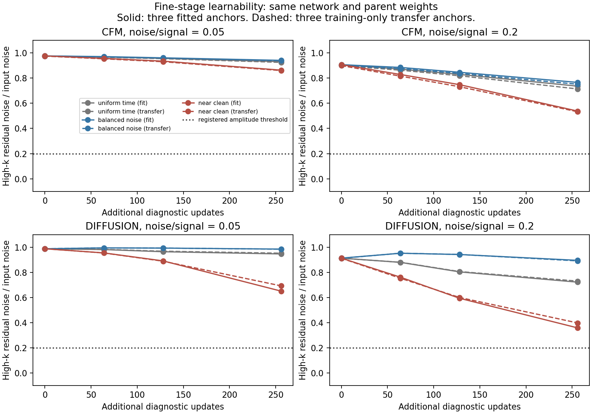

# Fine-stage noise-resolved learning test — 2026-09-15

User authorized the recommended small learning test and results reporting.
This is a separate diagnostic experiment, not continuation of the full E2E
run, a model replacement, or permission to open held-out phases.

## Result: partial learning, no demonstrated near-clean capability

Completed job **58358688** on nid001001, one A100: experiment 7m41.27s,
allocation 9m00s, released normally. Both application steps and allocation are
COMPLETED 0:0. Source at launch `5134485`. All six 256-update fits, 1,440 probes,
48 true-coarse diagnostic draws and 18 checkpoints completed; all initial
model/optimizer and paired-probe checks passed. Final source/parent bindings
are unchanged. Eight focused tests pass. Training-noise seeds are disjoint
from evaluation seeds and only the three registered fit anchors received updates.

**None of the six fits passes the registered learnability check**, either on
fitted anchors or on the three training-only transfer controls. Every one of
the 72 phase/ratio/group/arm checks fails; these are correlated checks, not 72
independent tests. The practical capability required by the E2E method remains
undemonstrated. This bounded result does not prove architectural impossibility.

### Noise remaining after 256 diagnostic updates

Values below are median signed high-k noise-amplitude projections on the
fitted anchors, at sigma/alpha=.05. Lower is better; threshold <=20%.

| Noise exposure | CFM | Diffusion |
| --- | ---: | ---: |
| Original 384-update parent | 97.67% | 98.72% |
| Additional uniform-time training | 93.07% | 94.63% |
| Balanced five-noise-level training | 94.14% | 98.47% |
| Near-clean-only training | 86.35% | 65.02% |

The near-clean-only branch improves the most, but remains well short of the
criterion. At ratio .2 it retains 53.78% CFM / 35.79% diffusion noise amplitude.
Transfer-anchor values are 86.03%/69.22% at ratio .05 and 53.26%/39.74% at ratio .2.
All three phases show failure: fitted ratio .05 values are 85.98--87.07% for
near-clean CFM and 63.31--67.93% for near-clean diffusion.

Near-clean fitted lower-band gains remain close to unity: at ratio.05,
approximately .998--1.001 for the specialized fits; at ratio.2,
.961--.967 CFM / .974--.981 diffusion. Thus the observed near-clean improvement
is not simply destruction of those lower-frequency signals. It is nevertheless
insufficient: fitted high-k clean-error power after near-clean specialization
is about84%/61% of its parent at ratio.05 and52%/37% at ratio.2, rather than
the required <=25%. These percentages summarize the ratio of panel-median
powers; the archived pass/fail checks use paired ratios per phase/noise seed.

### Specialist improvement does not make a usable all-noise denoiser

At ratio20, the near-clean diffusion branch's fitted low-band signal gains
fall to[.0049,.0037,.0031], with high-k error power about8.66 times its parent.
Near-clean CFM gains fall to[.0835,.104,.118]. Specializing on a restricted
noise range damages performance outside that range; this was checked explicitly
and is not a surprise generalization failure on sealed data.

The generated true-coarse controls confirm the practical consequence. On fitted
anchors, near-clean CFM middle-band power/truth becomes .090/.192 (parent
.455/.685); near-clean diffusion becomes .070/.061 (parent .547/.755).
High-k power/truth decreases to18.41 CFM /8.02 diffusion, but remains excessive.
Their fields look less noisy partly because they lose much of the desired
middle-scale structure. Smaller density-support violations therefore cannot be
treated as sufficient success. These are oracle controls, not production draws.

Ordinary-time training improves a broader range of noise levels and generated
fields: fitted middle-band power/truth becomes .806/.834 CFM and1.014/1.087
diffusion, with high-k ratios22.63/38.21 (parents59.75/80.80). But near-clean
denoising remains weak, and transfer spectra still differ. A few fields with
improved spectra are not evidence of posterior calibration or E2E convergence.

### What this isolates, and what it does not

There is genuine partial learnability: the near-clean diffusion curve continues
to improve through the endpoint, including transfer anchors. More optimization
could help; no saturation or in-principle capacity limit is established. However,
simply allocating equal updates across five noise levels is not an effective
remedy in this protocol, and near-clean specialization is not a viable replacement
for the all-noise model. The chosen time distribution changes the optimization
objective; these arms are deliberately diagnostic, not equivalent estimators.

Gradient clipping was active on 95.7--100% of updates (near-clean diffusion
96.1%, CFM 99.2%). Median pre-clip norms span 2.78--9.55 for a clip threshold 1.
That is an optimization warning to investigate, **not proof clipping caused the
failure**: no clipping or optimizer-state ablation was run. AdamW state was
inherited in every arm, so adaptation of its moments also remains a limitation.

**Decision:** keep the original E2E run paused at384 and promote none of these
diagnostic branches. Before a large extension, require a fine-stage model that
passes noise removal plus signal-preservation checks across the needed noise
range. The next focused investigation should separate optimization from
time-conditioning/parameterization (for example, a fixed-noise-level control
with measured gradients and noise response), not assume this test proves a
particular architectural fix. No further experiment, architecture revision or
held-out opening was executed or automatically authorized by these results.

## Evidence

Raw curves/probes, training histories,18 checkpoints and48 diagnostic fields:
`/pscratch/sd/d/dkololgi/abacus/e2e_field_v2/wide_pipeline_v1/fine_learning_20260915_58358688/`.
The `LEARNING_COMPLETE.json` SHA256 is
`7ce15d01afc4625b403dfe7ffc7a0de730b407154966f72b9c131a1337bf7a1d`.
Scratch is not backed up. Compact overall/phase curves, all checkpoint and
draw hashes, all registered checks, source bindings, run receipt and figure
are archived in `docs/evidence/e2e_field_v2/fine_learning_20260915/`.
`e2e_fine_learning_report.py` reproduces the summary and figure from the raw
receipt. Original parents, coarse models, normalization and release flags remain
unchanged. No P12/D2/P13 changes or held-out payload access occurred.

## Frozen design

Start every arm from the same 384-update fine model **and AdamW state** for its
method. Keep the architecture, normalization, learning rate, weight decay,
gradient clipping, velocity target and MSE formula unchanged. Train only three
anchors: ph000/002/003 NGC, shell0, boundary00. True coarse conditioning is
deliberate teacher forcing to isolate the fine operation. Coarse models stay
frozen. The only arm difference is noise-time exposure:

- `uniform_time`: the original uniform-in-time distribution for each method.
- `balanced_noise`: equal cycling through sigma/alpha=.05,.2,1,5,20.
- `near_clean`: equal cycling through .05 and .2, a deliberately easier
  near-clean-only learning stress test; failure at high noise is not surprising.

Use 256 fresh-noise updates per arm and method: six fits, 1,536 updates total.
Anchor order and Gaussian noise are paired between arms and methods. Schedule
levels cross all three anchors; time and noise seeds have separate namespaces.
Baseline uniform times have the same distribution as the old objective, not
the identical original RNG sequence. Preserve original parents immutably;
all 18 new checkpoints carry a separate experiment binding and inherited history.
Checkpoint step448/512/640 means original384 plus diagnostic64/128/256, not a
claim that the 96-anchor E2E run has advanced to640.

At diagnostic updates0/64/128/256, evaluate all five noise ratios with two
fixed evaluation-noise seeds excluded from training. Evaluate both the fitted
NGC anchors and opposite-cap SGC anchors matched by phase/shell/support. These
six parents are all from the original training pool. The additional three
are transfer controls, **not validation or independent held-out phases**;
the cap change also changes conditioning/domain. There are1,440 probes.
Initial probes must be identical between all arms of a method.

Generate one fixed-seed, true-coarse fine draw per anchor from each parent
model and each final branch:48 diagnostic fields. These assess whether a
specialist near-clean fit damages the rest of generation; they are not
deployable samples or calibrated posterior checks. No density clipping,
additional smoothing, training-target changes or modified sampler is allowed.

## Predeclared learnability check

For **each phase** at both near-clean ratios, using medians over two evaluation
noise seeds, require all of:

1. Absolute signed high-k residual-noise amplitude <=.2 of input noise.
2. High-k clean-error power <=.25 of its matched parent-model baseline.
3. Signal gain between .9 and1.1 in each of the three lower-k bands.

This demands actual noise removal while preserving signal, not merely a lower
aggregate loss. Report fit and transfer checks separately and retain failures;
the thresholds are engineering criteria, not a physics/calibration release gate.
Inspect the entire noise-resolved learning curve, absolute errors and generated
power, including regressions. A bounded failure cannot prove that an architecture
is incapable in principle; a tiny-panel success cannot demonstrate generalization.

If uniform-time improves, undertraining is plausible. If balanced/near-clean
exposure improves more at equal updates, noise exposure matters under this
protocol. If none succeeds, this experiment alone cannot choose between longer
optimization, inherited optimizer effects, capacity or time-conditioning problems.
No post hoc architecture change, extra fitting or automatic extension follows.

Use one GPU for at most one hour; application work stops at45 minutes if needed.
Nonfinite training/gradients, baseline mismatch, provenance drift or budget expiry
fail closed. Original source/checkpoint bindings and sealed phases stay frozen.
Code: `workflows/sbi/e2e_fine_learning_test.py`; contract:
`configs/e2e_fine_learning_20260915.json`. Run/evidence details follow on completion.
