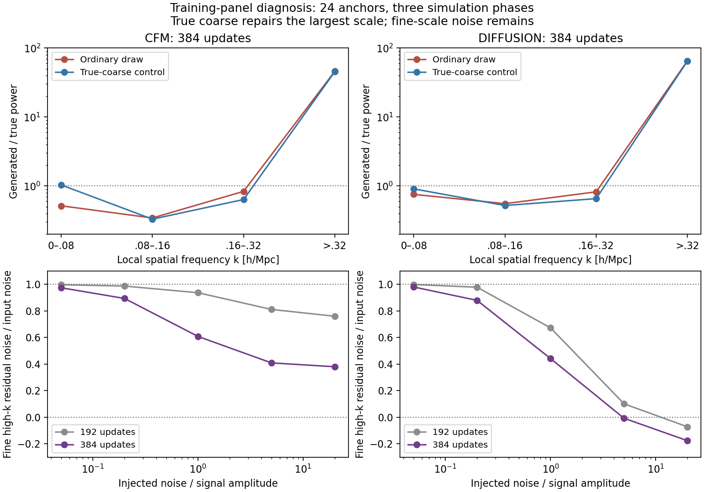

# Wide E2E denoising localization — 2026-09-15

Status: completed with explicit user approval, job **58352703**, nid001028,
one A100 GPU. Audit 11m42.15s; total allocation 15m29s, released. All three
application steps and the allocation are COMPLETED 0:0. No fitting,
architecture/target changes, smoothing, clipping, held-out payload access or
model promotion occurred. Source at launch: `3aba780`; five focused tests pass.

## Result: fine-stage noise cancellation and a separate large-scale deficit

The 1,920 probes, 384 component decompositions, 48 true-coarse controls and
216 intermediate sampler records all completed. Algebraic identities, physical
component sums, signed power closure, checkpoint/draw hashes and instrumented
replay checks passed. Original model/data/normalization/continuation provenance
is unchanged. This localizes a learned denoising problem, not a basic sign or
time-convention error. It does not establish why the network learned this map.

All numbers below are training-panel medians, not independent validation tests.
The two methods are CFM and cosine VP v-prediction diffusion. Local bands are
(0,.08],(.08,.16],(.16,.32],>.32 h/Mpc; largest scale means the first band.

| Diagnostic at update 384 | CFM | Diffusion |
| --- | ---: | ---: |
| Fine component / total generated power above k=.32 | 98.97% | 99.29% |
| Total generated high-k power / truth, four draws per anchor | 46.03 | 65.37 |
| High-k fraction of all generated fluctuation power | 30.25% | 31.96% |
| Largest-scale power / truth, ordinary draw 0 -> true-coarse control | .516 -> 1.035 | .756 -> .908 |
| High-k power / truth, ordinary draw 0 -> true-coarse control | 45.99 -> 45.43 | 65.02 -> 64.49 |
| Near-clean fine noise amplitude remaining, sigma/alpha=.05 | 97.39% | 97.96% |

Truth has only 0.498% of local fluctuation power in the highest band. Thus its
small denominator magnifies ratios, but the excess is also large as a share of
generated variance. The fine-component percentages include a separate signed
cross term; they are not orthogonal variance attribution or percentages of
error. The high-k contribution is 98.93--98.98% CFM / 99.29--99.30% diffusion
in each of the three phases.

### 1. Near-clean fine denoising largely passes injected small-scale noise through

At sigma/alpha=.05, 94.62% CFM / 96.65% diffusion of band-summed physical
velocity-error power lies at k>.32. The projection of clean-estimation error
onto the known injected noise, divided by its input coefficient sigma, is
.9739/.9796. This is a signed amplitude projection, **not an RMS ratio or a
posterior uncertainty measure**. The corresponding noise-correlated share of
high-k error power is 97.48%/97.89%. Phase-wise amplitude projections remain
.9729--.9742 CFM and .9777--.9810 diffusion.

The near-clean fine velocity MSE is still 1.0244/0.9977 in normalized units.
Clean MSE looks small (.002323/.002488) because conversion multiplies velocity
error by the small sigma: a small clean error alone would hide this failure.
At sigma/alpha=.2 the residual noise amplitude is still 89.35%/87.91%, and
high-k error power is 3.56/4.81 times true high-k power. In absolute relevance,
those errors are 2.41%/3.29% of total fine-target fluctuation power; at ratio1
they reach 12.15%/14.76%.

The coarse denoisers also pass much near-clean high-frequency noise through
(97.82%/94.41% amplitude in their k>.16 band). Their enormous high-k/truth
ratios are dominated by nearly absent true coarse power and should not be
quoted as physically meaningful factors. Interpolation reduces their share
of final local k>.32 power to about 1%; they are not the primary source of the
local fine-scale excess.

### 2. Exact coarse conditioning does not cure the fine-stage problem

With identical fine random seeds and true coarse both in the conditioning and
the reconstructed sum, largest-scale power moves much closer to truth. But
high-k power changes only about 1%; the residual still contains extreme excess.
The middle bands also remain deficient: oracle total power ratios are
[1.035,.330,.637,45.43] CFM / [.908,.521,.656,64.49] diffusion. The .16--.32
band becomes *more* suppressed, consistent with removing spurious power that
ordinary coarse draws were contributing there.

This isolates coarse-generation/coarse-fine coupling as important to the
largest-scale deficit, while the fine-stage failure survives correct coarse
information. It does not separate the additive coarse contribution from its
conditioning effect, nor justify replacing inference inputs with truth.

### 3. Sampler trajectories expose persistence and late growth of the excess

On the six preselected boundary/extreme-shell anchors, CFM's intermediate
fine clean estimate already has median high-k/true-residual power 56.36 at the
pure-noise start, dips to 42.95, and finishes near 47.95. Diffusion starts at
13.64, falls to 7.14 at t=.875, then rises through 34.81 at t=.5 to 66.85 at
t=.03125. Thus diffusion's wrong small-scale power grows in the later part
of generation, where controlled probes show poor cancellation. This is not
proof that injected-noise probes and sampler states have identical errors:
off-distribution sampler states may amplify the learned failure.

Every instrumented final stage field exactly reproduces the saved draw.
Together with the previous small sampler-refinement drift and exact analytic
sampler tests, this argues against simply increasing integration steps as the
main remedy. CFM's call31 is the Heun proposal evaluation, not the accepted
final state; the reported endpoint distinction is preserved in the raw records.

### 4. More training helped some noise levels, not the near-clean endpoint

From 192 to 384, fine high-k residual noise amplitude at ratio1 falls
.9367 -> .6079 CFM and .6721 -> .4411 diffusion. At ratio.05 it only falls
.9967 -> .9739 and .9983 -> .9796. Most near-clean noise still survives.
For diffusion at ratio20, high-k error/truth actually worsens 9.99 -> 11.40;
an aggregate loss decrease is not uniform denoising progress. Suppressed gain
at high noise includes irreducible conditional uncertainty and is not, alone,
evidence of a coding bug or collapse.

**Decision:** retain the stop at 384. There is now a concrete failure target:
fine-stage high-k cancellation near the clean end, plus coarse/coupled
large-scale power recovery. The audit does not distinguish insufficient
optimization from weak time conditioning, limited backbone capacity or loss
weighting. The next separately authorized training experiment should be a
small fixed-panel overfit/learning-curve test spanning these noise levels,
tracking absolute band errors and signal gain. If it cannot learn near-clean
cancellation on training cases, test time conditioning/capacity/objective
weighting in controlled ablations before a large extension. Do not repair
plots by smoothing/clipping, or open held-out confirmation for this diagnosis.
Any revised model still needs separately authorized validation/calibration.

The figure's upper panels use paired draw0 seeds, with truth power marked at1.
Lower panels are signed noise projections (negative means anticorrelation,
not negative noise power). They compare equal sigma/alpha, not equal time.

## Reproducibility

Full raw probes, components and trajectories:
`/pscratch/sd/d/dkololgi/abacus/e2e_field_v2/wide_pipeline_v1/denoise_20260915_58352703/DENOISING_AUDIT_COMPLETE.json`.
Its SHA256 is `53907fffe06253818ad899436832f7fb423ea7cfcd96eae366e7b36d2f6ab56b`.
The same directory contains 48 true-coarse diagnostic HDF5 files, not production
draws. Scratch is not backed up. Compact registration, checkpoint hashes,
all oracle file hashes, overall and phase summaries, scheduler receipt and
figure/source are archived under
`docs/evidence/e2e_field_v2/wide_denoising_20260915/`.
`e2e_wide_denoising_report.py` creates SUMMARY; the archived `plot.py` creates
SUPPLEMENTARY and the figure. All release flags and earlier negative-domain
receipts remain unchanged; no P12/D2/P13 artifacts were changed by this audit.

## Registered comparison

Use the unchanged balanced 24-anchor training diagnostic panel from the 384-update
evaluation (ph000/002/003, four shells, two support strata). Compare the frozen
192- and 384-update checkpoints, both CFM and diffusion, both coarse and fine
stages, with two common Gaussian-noise replicates per anchor/stage and five
noise/signal amplitude ratios: 0.05, 0.2, 1, 5, 20. This gives 1,920 controlled
forward probes. Time conventions differ: CFM data is at t=1, diffusion data at
t=0. Match sigma/alpha, not time or absolute noise amplitude.

The exact clean estimates are x+(1-t)v for CFM and alpha*x-sigma*v for diffusion.
Check the error identities against the known injected noise on every probe.
Analytic-oracle unit tests also exercise both actual sampling implementations.

Use weighted demeaning and a 3-D Hann window, with full-rFFT multiplicities.
Sum window-normalized fluctuation powers in coarse k bands (0,.04],(.04,.08],
(.08,.16],>.16 and fine/local bands (0,.08],(.08,.16],(.16,.32],>.32 h/Mpc.
Report absolute error power alongside error/truth, gain, correlation, noise
leakage, and velocity-error band fractions. Window leakage prevents interpreting
the globally low-pass coarse target as exactly band-limited on each crop.

Decompose all 384 saved draws on this panel (two checkpoints, two methods, four
draws) into interpolated coarse power, residual power, and signed cross-power.
The residual is not an orthogonal high-pass field; do not discard cross-power.

Generate 48 explicitly labelled **true-coarse diagnostic** local fields at step
384, with the same fine-stage seeds as saved draw 0. This isolates dependence on
the coarse input but is an oracle control, not an inference result or correction.
For six boundary anchors in shells 0 and 3, instrument both sampler stages at
every fourth network call plus call 31. Require exact reproduction of both
saved stage fields; inspect intermediate predicted-clean spectra. Odd CFM call
31 evaluates the Heun proposal, not the final accepted state.

## Interpretation and stop conditions

High-noise pointwise error includes conditional uncertainty; low gain there is
not by itself a denoiser bug. Near-clean recovery can preserve the input almost
trivially, so inspect velocity error/noise cancellation as well. High-k ratios
can be inflated by very small truth power; use absolute errors and total-power
fractions before attributing physical importance. These are correlated training
anchors with only three phase units, not validation or posterior calibration.

Stop on provenance drift, checkpoint/draw checksum mismatch, failed algebraic
closure, or nonidentical instrumented replay. No automatic restart or additional
training. Keep the original source, checkpoints, normalization, continuation
binding, negative-domain receipts and release flags frozen. Outputs live in a
new dedicated Scratch directory; archive compact receipts/results in this repo.

Entrypoint: `python -m workflows.sbi.e2e_wide_denoising_audit --output <new-path>`.
