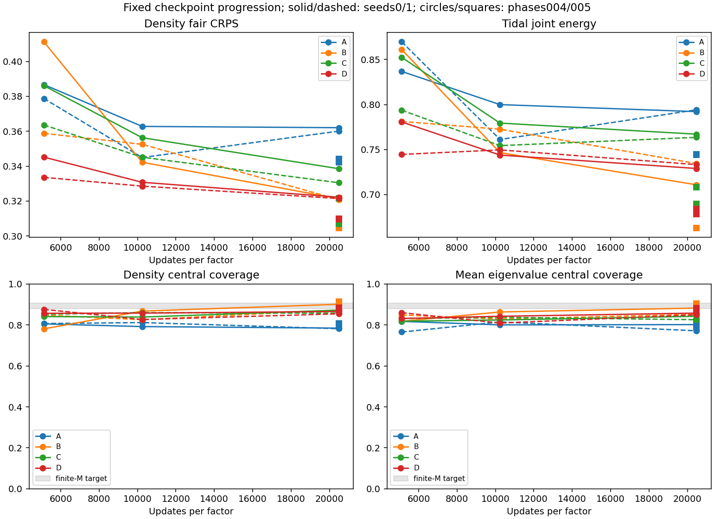
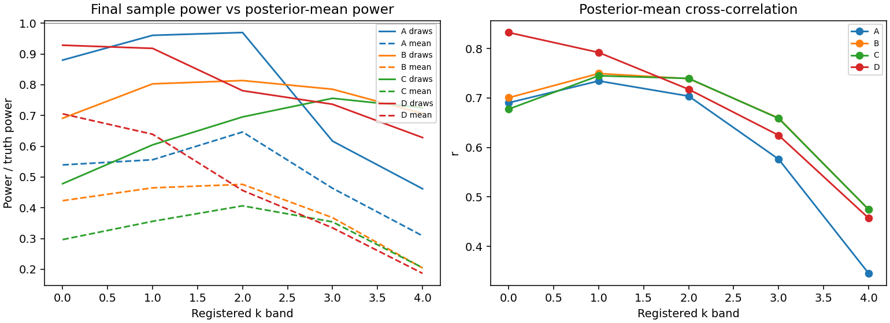
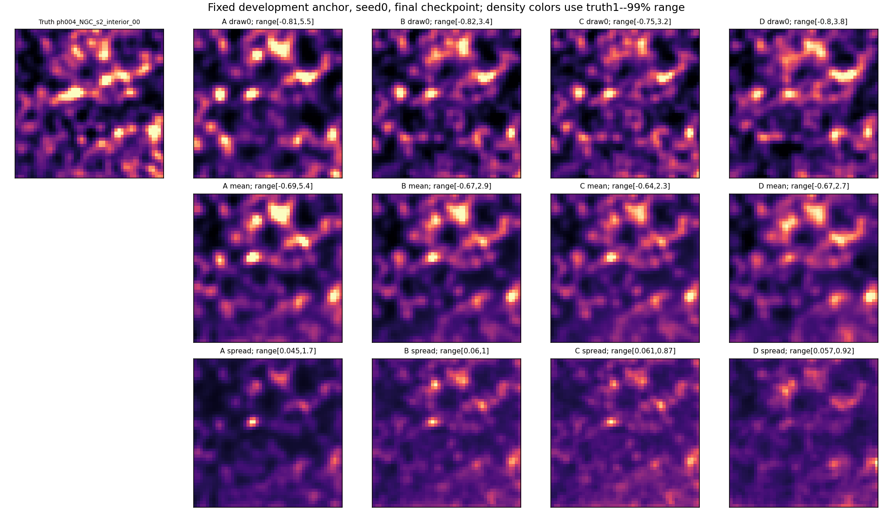

# Controlled VDM field-posterior experiment

All registered checkpoints and draws are assessed; no validation-selected checkpoint.
A:32 fields, summary context; B:384 fields, same context; C:spatial wide context; D:shared stochastic coarse/fine.

Saved central draws: 33280; shared coarse draws: 7872.

| Contrast | Pooled primary-score gain | Joint registered gate |
| --- | ---: | --- |
| H1_diversity | 10.88% | PASS |
| H2_observed_context | -3.37% | NOT ESTABLISHED |
| H2_multiscale_package | 3.54% | NOT ESTABLISHED |

Individual seed/phase cells, coverage, power, paired dependence and spatial uncertainty are in RESULTS.json.
A failed contrast is inconclusive at this budget, not proof that its physical hypothesis or VDM is false.

## Claim boundaries

- two programme-exposed evaluation phases
- D adds a coarse model and compute
- no audited fibre/redshift-success response
- shared coarse does not prove full fine dependence
- matter beyond the wide domain is absent
- grid probes are correlated
- coarse factor sees wide observations only; sufficiency for all local observations is unproven
- fine cores are conditionally independent given the shared coarse field

No real-DESI production release, full-field SBC claim, or automatic architecture/optimizer change.
Final allocated GPU/CPU time and Scratch footprint are recorded in EXPERIMENT_COMPLETE.json after Slurm accounting closes.
