# Random-catalog and density-robust graph/point-cloud methods

Research lookup: 2026-07-14. Project-specific staged-mock and JEPA update:
2026-07-26. The preferred `parallel-cli` backend was not installed, so the
references below were verified through primary journal, conference, arXiv, and
collaboration sources.

## Closest astrophysical match: ASTRA

Forero-Romero et al., *Cosmic web classification through stochastic
topological ranking*, RASTI 4 (2025), arXiv:2404.01124,
doi:10.1093/rasti/rzaf032.

- Paper: https://academic.oup.com/rasti/article/doi/10.1093/rasti/rzaf032/8221862
- Preprint: https://arxiv.org/abs/2404.01124
- Merge an object catalogue O with a random catalogue R that has the same
  selection function and geometry, then Delaunay-triangulate O union R.
- For each point use the bounded local contrast
  `r = (N_O - N_R)/(N_O + N_R)`. Unlike `N_O/N_R - 1`, it remains defined when
  a dense region has no random neighbours.
- Repeat over random-catalogue realizations to get class probabilities and
  entropy.
- Important limitation: its three tested catalogues differ in global number
  density by only about a factor 6.5, not 10^3. It is a strong methodological
  precedent, not validation of three-decade sampling-density transfer.

Zapata-Zuluaga et al., *The Cosmic Web in the DESI Early Data Release: A
Probabilistic Environment Catalog* (2026), arXiv:2604.01456.

- https://arxiv.org/abs/2604.01456
- Applies ASTRA to DESI BGS, LRG, ELG, and QSO catalogues using matched randoms
  and 100 realizations per tracer-zone pair.

## Why matched random catalogues are the correct reference measure

Ross et al., *The Construction of Large-scale Structure Catalogs for the Dark
Energy Spectroscopic Instrument*, JCAP 2025(01)125, arXiv:2405.16593.

- https://arxiv.org/abs/2405.16593
- DESI randoms are an unclustered sampling of the probability that DESI could
  observe a tracer at each location. They encode footprint, completeness, and
  redshift-dependent selection.

Landy & Szalay, *Bias and variance of angular correlation functions*, ApJ 412,
64 (1993), doi:10.1086/172900.

- https://inspirehep.net/literature/369928
- Establishes the data/random reference construction through the nearly
  Poisson-variance estimator `(DD - 2 DR + RR)/RR`.

Cole, *Maximum Likelihood Random Galaxy Catalogues and Luminosity Function
Estimation*, MNRAS 416, 739 (2011), arXiv:1104.0009.

- https://arxiv.org/abs/1104.0009
- Constructs random catalogues for flux-limited samples without fitting away
  real radial large-scale structure.

## Density-adaptive astronomical geometry

Schaap & van de Weygaert, *Continuous Fields and Discrete Samples:
Reconstruction through Delaunay Tessellations*, A&A 363, L29 (2000),
astro-ph/0011007.

- https://arxiv.org/abs/astro-ph/0011007
- DTFE is fully adaptive: high-density regions are resolved finely, while
  low-density regions are reconstructed more smoothly; it also preserves
  anisotropic structures such as walls and filaments.

## ML operators for non-uniform point sampling

Hermosilla et al., *Monte Carlo Convolution for Learning on Non-Uniformly
Sampled Point Clouds*, SIGGRAPH Asia 2018, arXiv:1806.01759.

- https://arxiv.org/abs/1806.01759
- Treats convolution as a Monte Carlo integral and divides each neighbour's
  contribution by its estimated sampling PDF. This is the cleanest theoretical
  basis for density-corrected graph messages.

Wu, Qi & Fuxin, *PointConv: Deep Convolutional Networks on 3D Point Clouds*,
CVPR 2019, arXiv:1811.07246.

- https://openaccess.thecvf.com/content_CVPR_2019/html/Wu_PointConv_Deep_Convolutional_Networks_on_3D_Point_Clouds_CVPR_2019_paper.html
- Learns a continuous spatial kernel and applies an inverse KDE density scale
  to compensate non-uniform sampling.

Qi et al., *PointNet++: Deep Hierarchical Feature Learning on Point Sets in a
Metric Space*, NeurIPS 2017, arXiv:1706.02413.

- https://arxiv.org/abs/1706.02413
- Uses multi-scale/multi-resolution grouping plus random input dropout so the
  model learns to change receptive scale as sampling density changes.

Anagnostidis et al., *Cosmology from Galaxy Redshift Surveys with PointNet*,
MNRAS 2023, arXiv:2211.12346.

- https://arxiv.org/abs/2211.12346
- Direct astrophysical use of PointNeXt/PointNet-style models; explicitly
  motivates point methods because voxelization struggles with galaxy-density
  dynamic range and notes adaptive multi-scale processing of non-uniform sets.

Makinen et al., *The Cosmic Graph: Optimal Information Extraction from
Large-Scale Structure using Catalogues*, Open Journal of Astrophysics 2024,
arXiv:2207.05202.

- https://arxiv.org/abs/2207.05202
- Graph-ML precedent for catalogue-level cosmology, including noisy survey
  cuts, but it does not itself solve a 10^3 selection-density transfer problem.

## Recommended combined construction for a GNN

1. Generate a matched random catalogue with intensity proportional to the
   expected selection function, not the observed clustered density.
2. Build a Delaunay or multi-scale radius graph on data plus random nodes, with
   a node-type bit.
3. Aggregate data and random messages separately and expose a stabilized
   contrast such as `(S_D - alpha S_R)/(S_D + alpha S_R + epsilon)`.
4. Add `log nbar` or a random-derived local spacing, and normalize lengths by
   `ell(x) = nbar(x)^(-1/3)`. A 10^3 density range is then a 10x range in mean
   interpoint spacing.
5. Use density-compensated messages (Monte Carlo convolution/PointConv) or
   multi-scale branches, and train with Poisson thinning sampled log-uniformly
   over the intended density range.
6. Validate by held-out density shells and spatial blocks. Randoms remove the
   selection baseline; they cannot restore information lost to shot noise, so
   uncertainty must widen and very sparse cases may remain prior dominated.

## 🔄 Progressive-degradation mocks as paired observation operators

### Executive assessment

The staged LSS catalogues are potentially one of the most useful assets in the
generalisation programme. Their main value is not that they create more
independent training examples. They provide **paired, counterfactual
observations of the same latent matter field** after different parts of the
survey observation process have acted on it.

The central recommendation is:

> Treat the degradation ladder as a known family of observation operators and
> paired counterfactual views—not as extra cosmological training data, and not
> automatically as a curriculum.

The first experiment should be a phase-balanced supervised mixture with
deployable response conditioning. A clean-to-degraded curriculum is a secondary
ordering ablation. Cross-stage JEPA is a promising but more ambitious P11
experiment, to be tested only against strong supervised-mixture, paired-
consistency, and masked-reconstruction controls.

This ordering matters. Curriculum learning primarily changes the order in which
an optimiser encounters examples; it does not by itself expand the training
distribution.[^curriculum] Mixing stages expands coverage of the observation
distribution and is therefore closer to domain randomisation.[^domain-random]
Careful domain-generalisation benchmarks also show that ordinary empirical risk
minimisation over a diverse training mixture is a difficult baseline to
beat.[^domainbed]

### What the local mock stages actually contain

There are two related but non-identical product lineages in this repository.
They must not be described as one continuous, already-audited training ladder.

| Product/view | Confirmed contents | Current interpretation |
| --- | --- | --- |
| Stage 0 CutSky | Populated lightcone with halo linkage; it already has observed/RSD `Z`, while `Z_COSMO` is the real-space oracle | Clean with respect to survey losses, not clean with respect to RSD |
| Stage 1 subset | BGS magnitude selection and optional simple cap geometry | A magnitude-limited RSD view; the simple cap is not the DESI tile footprint |
| Stage 2 `forFA` | Targeting columns; the production Path1 version applies Y3 footprint/imaging masks and constructs potential assignment information | Targeting/footprint response |
| Fibre/full-LSS products | Four-pass fibre assignment, collision/availability geometry, duplicate assignment handling, and `full_noveto` | Fibre-observation response |
| Spectroscopic injection | LOA-calibrated marginal `ZWARN`, `DELTACHI2`, and `SPECTYPE` draws | Approximate spectroscopic response, not a complete conditional forward model |
| Final Path1 `mock_bgs_maglim` | The four final DESI GraphWeb selection cuts; 9,538,254 rows in the current P1b parent | Present deployment-like P8 catalogue |

The generic stage meanings and the `Z`/`Z_COSMO` distinction are recorded in
the [SecondGen mock README](../workflows/abacus_tweb/secondgen_mocks/ph000/README.md).
The current production chain is documented in
[STAGE3_DESI_ALIGNMENT.md](../workflows/abacus_tweb/secondgen_mocks/ph000/STAGE3_DESI_ALIGNMENT.md):

```text
forFA0 -> fibreassign -> assignwdup -> full_noveto
       -> LOA spectroscopic injection -> mock_bgs_maglim
```

The existing four-view wedge is an older, narrower proof of pairing. It used:

```text
annotated CutSky
  -> Stage-1 r < 19.5
  -> forFA0_nomask
  -> old datcomb_brightwdup with COLLISION == 0 and halo-triple deduplication
```

In its `0.25 < z < 0.30` wedge, the matched unique sets are exactly nested:
18,350 Stage-1 objects, 18,324 `forFA` objects, and 17,957 old Stage-3 objects,
with zero truth-join misses. The old Stage-3 table contained 50,076 tile rows
before repeat assignments were deduplicated. See the
[pipeline summary](../docs/evidence/p0s/ph000_manifests/wedge/staged_mock_wedge_pipeline_summary.json)
and [population-overlap audit](../docs/evidence/p0s/ph000_manifests/wedge/mock_wedge_population_compare.json).

That archive proves the identifier-based pairing concept, but it does **not**
reach the current final Path1 catalogue. Before scientific stage-mixed training,
the intermediate views should be re-exported from the current Path1 chain and
their `TARGETID`/halo-key overlap audited. `forFA0` and `forFA0_nomask` were
identical in the audited wedge despite their names, so they should not be
assumed to constitute distinct degradation views without resolving why.

The stage number is also not a physical scalar severity. Stage 1 already
contains RSD; later steps alternately add metadata, remove objects, and create
tile-level repeats. The model and manifest should use named observation
operators and their physical settings, not merely an integer `stage_id`.

```mermaid
flowchart LR
    accTitle: Paired observation-operator training
    accDescr: The same latent field is observed through successively richer survey operators. Each view is rebuilt independently and paired inside one phase and spatial split before a shared model predicts tidal information and uncertainty.

    matter_field["Latent matter field and T-Web target"]
    cutsky_view["Magnitude-limited RSD view"]
    targeting_view["Footprint and targeting view"]
    fibre_view["Fibre-assigned and collision view"]
    final_view["Spectroscopic and final-cut view"]
    shared_model["Response-conditioned shared encoder"]
    vac_output["Eigenvalue or tidal-tensor posterior"]

    matter_field --> cutsky_view
    cutsky_view --> targeting_view
    targeting_view --> fibre_view
    fibre_view --> final_view
    cutsky_view -. "paired context" .-> shared_model
    targeting_view -. "paired context" .-> shared_model
    fibre_view -. "paired context" .-> shared_model
    final_view -. "deployment context" .-> shared_model
    shared_model --> vac_output
    matter_field -. "simulation-only target" .-> vac_output

    classDef latent fill:#dcecff,stroke:#24527a,color:#111111
    classDef observed fill:#fff2cc,stroke:#806000,color:#111111
    classDef model fill:#e2f0d9,stroke:#3d6b2f,color:#111111
    classDef output fill:#f3e5f5,stroke:#6a3d73,color:#111111

    class matter_field latent
    class cutsky_view,targeting_view,fibre_view,final_view observed
    class shared_model model
    class vac_output output
```



The diagram is an intended re-export and training design, not a claim that the
current archived wedge already contains every Path1 view.

### The statistical object

Let a latent unit be

`u = (phase, HOD, observer, spatial core)`,

with physical target `y_u = T[rho_u]`. A staged catalogue is then

`x_(u,s) = A_s(g_u; eta_s)`,

where `A_s` is an observation operator and `eta_s` contains its realisation and
settings. Known, DESI-measurable response information is denoted `r_(u,s)`.

The supervised mixture objective is approximately

`E_u E_(s,eta) [w_s L(f(x_(u,s), r_(u,s)), y_u)]`.

This formalisation exposes four important points:

1. Several stages of one `u` are correlated views, not several universes.
2. Stage weights define an artificial observation-distribution prior unless
   the response is made explicit.
3. Removing galaxies changes the graph, local density estimate, shot noise, and
   available information; it is not a label-preserving image augmentation in
   the usual sense.
4. Independent phases, HODs, observers, and forward-model challenges are still
   required to establish generalisation.

### Mixing, curriculum, consistency, and JEPA test different hypotheses

| Training construction | Scientific hypothesis | Recommended status |
| --- | --- | --- |
| Final-stage supervised ERM | The deployment-like simulator alone is sufficient | Required control |
| Phase-balanced stage mixture | Broader observation-operator coverage improves final-stage transfer | First intervention |
| Mixture plus response conditioning | Known selection/completeness explains otherwise harmful domain shift | Preferred first model |
| Clean-to-degraded curriculum with replay | Example ordering improves optimisation beyond seeing the same mixture | Secondary matched ablation |
| Paired latent consistency | A selected physical subspace should agree across views | Useful bridge experiment |
| Cross-stage JEPA | Predictive latent pretraining captures physical structure shared across observation operators | Optional P11 experiment |
| Nuisance-marginalised posterior | Unknown observation/HOD/velocity variations should be integrated out | P12/VAC stage |

A pure sequential schedule such as `clean -> intermediate -> final` may provide
an optimisation warm-up, but it is the weakest generalisation claim. It can
cause catastrophic forgetting, teach reliance on information that disappears,
or overfit the last simulator's fingerprints. If tested, it should see exactly
the same multiset of examples and optimiser updates as a shuffled-mixture
control, retain auxiliary replay to the end, and differ only in ordering.

A concrete curriculum ablation is:

- first 20% of updates: final views paired mainly with cleaner/intermediate
  views;
- middle 60%: balanced final and auxiliary views;
- last 20%: 3:1 final-to-auxiliary sampling, retaining replay;
- compare with a random ordering of the same examples, learning-rate schedule,
  and optimiser state.

Only a final-stage gain in the ordered arm relative to this matched shuffled arm
is evidence for a curriculum effect.

### Recommended data and feature contract

#### Pairing and splitting

- Keep every stage, HOD, observer, and degradation seed for a latent patch
  inside the same outer phase and spatial split. Otherwise exact counterfactual
  views leak between train and evaluation.
- Sample `phase -> spatial core -> view` in that order. Do not let a phase with
  five stages carry five times the scientific weight.
- Use stable `TARGETID` plus `(FILE_NUM, HALO_INDEX, BOX_INDEX)` for audits and
  pairing. These simulation-only keys may be used by the data loader but must
  not become production features.
- For the cleanest initial comparison, score the final-survivor galaxy anchors
  at every stage while allowing earlier stages to provide their richer
  surrounding context. Also report fixed-grid/query-point metrics to avoid a
  survivor-only scientific conclusion.
- For U-PATCH or a future field tier, pair common observer-frame grid cells. For
  G-PATCH, rebuild topology and all topology-derived features independently for
  every view. Reusing clean-view edges, neighbourhood statistics, or global
  graph metrics is privileged-information leakage.

#### Response variables

Condition on response quantities that will exist for DESI:

- matched-random intensity or expected tracer density;
- imaging/targeting exposure and completeness;
- fibre-assignment coverage or probability;
- redshift success/quality and redshift-error scale;
- boundary or mask distance;
- line-of-sight direction and shell/redshift;
- local information support and effective sampling density.

An opaque `stage_id` is useful for diagnostics and possibly for a pretraining
predictor, but it should not be the production conditioner. DESI has response
maps and quality measures, not a simulator-stage label.

Random catalogues and response fields must be regenerated or matched to every
view. Reusing the clean randoms with a degraded data catalogue defines the wrong
reference measure. Randoms can correct the expected selection baseline; neither
randoms nor representation learning can recreate galaxies removed by shot
noise, collisions, or redshift failure.

#### RSD and other physical nuisances

RSD should be held fixed across the first survey-loss ladder by using observed
`Z` in every view. A separate paired `Z` versus `Z_COSMO` oracle experiment can
then isolate how much redshift-space information and distortion affect the
target. RSD should not automatically be erased as a nuisance: it contains
velocity and dynamical information correlated with the tidal field. A better
approach is to condition on the line of sight and forward model plausible
velocity-bias/RSD variations, marginalising uncertain parts in the eventual
posterior.

The same warning applies to magnitude selection and fibre loss. They can be
environment dependent. Adversarially deleting all stage information may also
delete genuine overdensity information, a known failure mode when enforcing
domain invariance under conditional or label-distribution shift.[^domain-harm]

### A physics-preserving representation, not total invariance

Strictly forcing the complete embedding or point prediction to be identical at
every stage is scientifically wrong. Later views contain less information, so
the Bayes-optimal conditional mean can change and its uncertainty should widen.
Multi-view methods work best when views retain redundant task-relevant
information; severe survey degradation violates complete redundancy.[^view-info]

A more appropriate representation is

`z = (z_phys, z_obs)`,

where:

- `z_phys` is encouraged to retain multiscale tidal morphology that can be
  predicted across paired views;
- `z_obs`, or an explicit response conditioner, retains sampling intensity,
  completeness, mask support, redshift quality, and other information needed
  to determine confidence;
- the eigenvalue/tensor posterior consumes both.

This decomposition is a modelling target, not an automatically identifiable
physical separation. Paired counterfactual views help supervise it, but do not
prove disentanglement. Anti-collapse regularisation such as variance/covariance
control is required if a direct invariance loss is used.[^vicreg]

### Cross-stage JEPA: the correct and incorrect versions

I-JEPA predicts latent representations of hidden target blocks from visible
context using a predictor and an exponential-moving-average target encoder. It
is not merely an objective that pulls two corrupted global embeddings
together.[^ijepa] A simple clean/degraded alignment loss is better described as
paired consistency or joint-embedding invariance; it remains a useful control.

A genuine cross-stage field-JEPA for this project would use:

- context encoder: a final-like or more-degraded patch with structured 3-D
  blocks hidden;
- target encoder: a less-degraded or independently degraded view of the same
  latent patch;
- predictor inputs: the context representation, target-block coordinates, and
  known response/transition metadata;
- target: target-encoder block latents, not the missing galaxy list, coordinates,
  or tidal labels;
- exponential-moving-average target weights and stop-gradient;
- supervised fine-tuning on final-like inputs and ordered-softplus eigenvalue
  targets.

In shorthand:

`L_JEPA = w_support ||q(E_ctx(x_i), r_i, r_j, anchor) - sg(E_tgt(x_j)[anchor])||^2`.

The support/teacher-confidence weight is important: the target view can contain
information that is not inferable from the degraded view, in which case an
unqualified squared loss encourages conditional-mean smoothing rather than
recovery of lost structure.

U-PATCH/grid JEPA is the preferred first implementation because it is the
current same-phase empirical leader and all views can be deposited onto one
physical lattice. A graph version is harder because nodes and edges disappear.
For Graph-JEPA, target nodes and their incident edges must be removed, and every
feature whose support included a hidden node must be recomputed or excluded.
Patch- or spatial-token targets are safer than aligning only surviving node
embeddings. Point-JEPA shows that JEPA-like prediction can be used for point
clouds, but its object-shape benchmarks do not validate sparse cosmological
catalogue transfer.[^point-jepa]

Mandatory matched controls are:

1. random initialisation;
2. supervised stage mixture;
3. masked reconstruction/denoising;
4. paired latent consistency;
5. cross-stage JEPA.

All must use the same backbone, splits, seeds, fine-tuning budget, and, as far
as possible, total optimiser updates. This comparison separates diversity gains
from pairing gains and JEPA-specific gains.

### Practical P8–P12 protocol

#### P8: preserve the frozen recovery experiment

Do not add stage mixing to the current P8 convergence extension. Its purpose is
to establish whether the present U-PATCH/G-PATCH comparison is stable under
additional optimisation and seeds. The current same-phase evidence is promising
but does not establish observation-operator or independent-phase robustness.

#### P10: build and test paired observation operators

1. Audit the current Path1 intermediate products and produce an immutable
   membership/overlap table for every view.
2. Re-export aligned magnitude-limited RSD, targeting/imaging, fibre-assigned,
   spectroscopic-precut, and final-cut views for each available phase.
3. Create stage-matched random/response fields and rebuild graphs or voxel
   fields independently for each view.
4. On `ph000`, run final-only, balanced mixture, conditioned mixture, and
   conditioned-mixture-plus-consistency arms at matched exposure.
5. Run the curriculum only as an order-controlled replay ablation.
6. Freeze the deterministic winner and carry it into `ph002`–`ph005` training,
   `ph006` validation/calibration, and the once-only `ph001` blind test.

A practical balanced epoch visits every latent training core once in the final
view and once in one uniformly rotated auxiliary view. Across epochs, auxiliary
operators are exactly balanced. This yields 50% deployment-like and 50%
auxiliary examples without allowing dense/easy stages to dominate.

The cumulative chain alone confounds effects. Add a small factorial branch that
toggles imaging, fibre, and spectroscopy singly and in selected combinations,
then randomise their strengths over plausible correlated ranges. Hold out at
least one effect combination or forward recipe. This is more informative than
adding several slightly different curriculum schedules.

The current LOA-like spectroscopic injection samples global pass/fail and
`DELTACHI2` marginals and explicitly does not correlate failure with local
density. A density-, magnitude-, observing-condition-, or alternate-recipe
challenge is therefore essential; otherwise the model can generalise only to
the limitations of this simulator.

#### P11: open JEPA only as a bounded bottleneck experiment

Use the same P10 phases and paired views. Compare the plan's random-init,
masked-reconstruction, and JEPA arms, augmented by the strong supervised-mixture
and paired-consistency controls above. Adopt JEPA only if it improves the
final-like fresh-phase/spatial-block metric by the plan's `+0.03` macro
`R^2(lambda_1)` target, or gives a comparably clear balanced-class/tensor gain,
without a material worst-shell or rare-knot loss.

JEPA may preferentially learn large-scale structures common to every view and
smooth away knots, small eigengaps, or orientation information. Guard with
per-class recall, all three eigenvalues, eigenvalue-gap bins, and, for a tensor
variant, eigenvector/orientation metrics.

#### P12 and the VAC: known response conditioned, unknown nuisance marginalised

For known response `r` and uncertain nuisance `eta`,

`p(y | x, r) = integral p(y | x, r, eta) p(eta) d eta`.

Known random support, completeness, and quality maps should be conditioned on.
HOD, velocity bias, observation realisations, uncertain small-scale velocities,
and forward-model variation should be sampled and marginalised. Broader staged
training does not by itself provide calibrated uncertainty.

Fit the posterior on out-of-fold predictions/embeddings from the training
phases, calibrate on `ph006`, and open `ph001` once. Require coverage,
SBC/TARP-style diagnostics, posterior contraction, width-versus-error, and
prior-dominated flags stratified by:

- redshift shell and effective sampling density;
- matched-random support and boundary distance;
- completeness, assignment probability, and redshift quality;
- observation operator and held-out degradation seed;
- web class, especially knots;
- phase, HOD, and observer.

When one stage is genuinely obtained from another only by information-removing
randomisation, expected posterior concentration should not improve as the
catalogue is degraded. Use increasing average posterior width/entropy as a
calibration diagnostic, not as a hard per-galaxy constraint: the local
catalogues need not be strictly nested, and composition changes can reverse
individual cases.

The VAC can expose this directly through selection/support, prior-domination,
and counterfactual-fragility flags alongside each eigenvalue/tensor posterior.
That is more scientifically honest and useful than claiming unconditional
survey invariance.

### Frozen ablation matrix

| Arm | Training data/objective | What the comparison identifies |
| --- | --- | --- |
| A | Final-stage-only supervised ERM | Deployment-like baseline |
| B | Phase-balanced stage-mixture ERM | Benefit of observation diversity: B versus A |
| C | B plus continuous response conditioning | Benefit of modelling known survey response: C versus B |
| D | Same examples as C, clean-to-degraded ordering with replay | Curriculum/order effect: D versus C |
| E | C plus paired latent consistency and anti-collapse term | Benefit of paired invariance: E versus C |
| F | Conditional cross-stage JEPA followed by the same C fine-tune | JEPA-specific gain: F versus E and masked reconstruction |

For every arm:

- match phase/core exposure, optimiser updates, folds, backbone, feature
  dimensions, transforms, seeds, and selection rule;
- select on the final production-like validation view, never the average across
  easier stages;
- report every stage, the worst stage/effect, held-out severities and effect
  combinations, and an alternate forward-model challenge;
- estimate uncertainty hierarchically by phase then spatial block, not by a
  galaxy bootstrap that treats paired views as independent.

The primary adoption rule remains a final-like fresh-phase macro
`R^2(lambda_1)` gain of at least 0.03, or a comparably clear balanced-class or
tensor gain, with no important supported-shell, boundary, ordering, rare-class,
or calibration regression.

### Failure modes to audit explicitly

- **Counterfactual leakage:** stages of one latent patch enter different splits.
- **Pseudoreplication:** five stage views are reported as five universes.
- **Topology leakage:** degraded graphs reuse clean edges or clean graph
  features.
- **Privileged-feature leakage:** `Z_COSMO`, true velocities, halo mass,
  simulation linkage, or target fields enter a production input or teacher that
  is distilled without a valid support guard.
- **Changing target population:** performance differences combine observation
  degradation with different galaxy populations.
- **Survivor bias:** only final surviving galaxies are evaluated, hiding failure
  in the field or in dense collision-prone environments.
- **Easy-view domination:** clean dense catalogues lower the average loss while
  final-stage performance worsens.
- **Stage shortcut:** the model memorises a generator label unavailable in
  DESI.
- **Impossible invariance:** the objective demands equal predictions after
  genuine information destruction.
- **Physics erasure:** nuisance invariance removes environment-dependent
  selection or dynamical RSD signal.
- **Catastrophic forgetting:** a sequential curriculum loses intermediate-stage
  robustness.
- **Simulator fingerprinting:** the model learns the single LOA-injection seed
  or marginal failure recipe.
- **False uncertainty:** nuisance diversity is presented as calibrated posterior
  coverage without out-of-phase calibration.
- **Shot-noise overclaim:** selection correction is described as recovery of
  absent small-scale information.

### Potentially distinctive method and defensible claim

The distinctive method is not simply "curriculum learning" or "JEPA." A stronger
research contribution would be a **counterfactual observation-operator
framework for tidal-field inference**:

1. identical latent cosmic structure viewed through progressively realistic
   DESI observation operators;
2. response-conditioned graph/field representations;
3. a physics-preserving paired latent rather than unconditional domain
   invariance;
4. independent-phase and held-out-forward-model validation;
5. calibrated eigenvalue/tidal-tensor posteriors with information-support and
   counterfactual-fragility flags.

This could plausibly be called *paired observation-operator training* or
*observation-ladder predictive pretraining*. A dedicated novelty search would
still be required before making a priority claim. No primary paper found in
this lookup directly validates staged-catalogue curriculum or JEPA for
per-galaxy tidal-eigenvalue inference. The cited ML work supplies mechanistic
precedents; SimBIG supplies the closer cosmological precedent for broad
forward-model coverage and alternate-simulator challenges, not proof of this
specific method.[^simbig-hod][^simbig-field]

### Clarifications: NEXUS+, conditioning variables, and random catalogues

#### NEXUS+ does not reopen the fixed T-web target

The existing smoothing experiments answer a narrower and more important target
question than the NEXUS+ question. They varied the fixed T-web smoothing radius
while keeping the same galaxy sample and proxy features. Bulk lambda1 R² peaked
near 10 Mpc/h, but cluster completeness and mass-anchored massive-halo recovery
both decreased with smoothing. The mass-anchored AUC for
`M > 10^13 Msun/h` fell from 0.789 at 6 Mpc/h to 0.770 at 7, 0.721 at 10,
and 0.637 at 20. The scientifically defensible decision is therefore to retain
the 7-Mpc/h T-web target and use approximately 10-Mpc/h information in the
features.

That experiment did **not** test NEXUS+. A fixed-scale T-web target is the
eigen-system of the smoothed gravitational-potential Hessian. NEXUS+ instead
log-Gaussian filters a positive density field over a bank of scales, evaluates
scale-normalized density-Hessian morphology signatures, and takes the largest
signature over scales.[^nexus-multiscale] It describes whether a location is
most strongly node-, filament-, or wall-like and at what characteristic scale;
it does not return the canonical 7-Mpc/h tidal tensor required by the VAC.

The prior scale tests therefore close **primary target-scale retuning**, but not
the possibility that explicit multiscale morphology could regularize a learned
representation. The useful NEXUS+ hierarchy is:

1. **Diagnostic now:** compute true-field NEXUS+ signature, class, and dominant
   scale for `ph000`; stratify frozen P8/P10 residuals by these quantities while
   controlling for shell and random support.
2. **Conditional auxiliary test:** only if a residual trend remains, compare
   the current encoder with a shared encoder having either 6/7/10-Mpc/h T-web
   auxiliary heads or NEXUS+ signature/scale heads. The auxiliary truth is a
   training label, never an inference-time input, and only the 7-Mpc/h output is
   retained for the VAC.
3. **Deployable observed-field feature, later:** NEXUS+ computed from a
   random-corrected galaxy field could be a classical feature or baseline, but
   only after its mask-edge, pseudocount, RSD, fibre-loss, sparsity, and
   dominant-scale stability are validated through the degradation ladder.
4. **Do not do:** replace the dynamical target with NEXUS+ or feed a
   true-matter NEXUS+ map to the DESI estimator.

The multiscale T-web auxiliary control is important. It distinguishes a generic
benefit from extra scale-aware supervision from a specific benefit of
log-density morphology. U-PATCH already has a multiresolution receptive field,
so NEXUS+ would add an inductive bias rather than observational information.
Promote it only for fresh-phase improvement without a rare-knot, supported-shell,
boundary, or orientation regression.

The original NEXUS scale range must not be copied uncritically: its prominent
simulation structures were captured over roughly 0.5–4 Mpc/h, whereas the BGS
mean tracer separation and the present target/feature scales are much larger.
The scale bank for a galaxy-field experiment must be chosen from resolution,
support, and mock-degradation tests, not from the matter-field default.

#### Which metadata should enter the model

“Conditional training” should not mean giving the network every simulator
label. The clean software and statistical contract is:

~~~text
sample.meta = phase, observer, HOD, stage, seeds, latent core, provenance
sample.x    = graph or field rebuilt for the selected observation view
sample.cond = numerical response quantities available for DESI
sample.y    = shared ordered eigenvalue-increment or tensor target
prediction  = model(sample.x, sample.cond)
~~~

| Quantity | Sampler/split/diagnostic role | Production model input |
| --- | --- | --- |
| Phase | Outer universe split and phase-balanced sampling | Never |
| Observer | Group overlapping views of one periodic structure | Never; use the actual LOS |
| HOD family/seed | Pairing and robustness strata | Never; vary and later marginalize |
| Stage/degradation seed | Choose paired views and report failures | Never in the downstream estimator |
| TARGETID/halo/base-box keys | Pairing and leakage audit | Never |
| Shell label or cap | Balanced metrics and response fitting | Avoid one-hot IDs |
| Continuous redshift or `log ntilde(z)` | Physical/selection response | Yes |
| LOS vector | Geometry and RSD response | Yes |
| Expected intensity, exposure, completeness, assignment probability, redshift quality/error, mask distance, support | Known observation response | Yes |
| `Z_COSMO`, true velocity, halo mass, matter/T-web/NEXUS+ truth | Targets, oracle tests, or declared auxiliary labels | Never |

This prevents shortcuts. A model given `stage_id=3` can learn the simulator's
average correction for stage 3, but DESI has no such label. A model given the
actual local fibre coverage, random intensity, redshift-error scale, and LOS can
learn a response that is evaluable on DESI.

The first implementation should use direct concatenation:

- **U-PATCH:** response quantities are additional voxel channels. The frozen P8
  control currently consumes only `counts`, `exposure_apodized`, and
  `log_count_ratio`; its stored LOS and other P3 fields are not in the current
  three-channel tensor (`workflows/abacus_tweb/p8_train_unet_patch.py`). P3a
  explicitly marks its galaxy-occupancy exposure as an approximation to be
  replaced by versioned random/exposure fields in P3b
  (`docs/evidence/p3/p3_field_schema_v1.json`).
- **G-PATCH:** interpolate response fields at each galaxy and append them to the
  node features. The frozen P8 graph control currently has seven graph features
  plus standardized `log ntilde(z)`, but no random-derived exposure,
  completeness, or stage information
  (`workflows/abacus_tweb/p8_prepare_graph_features.py`).
- **Patch summaries:** broadcast legitimate scalars to nodes/voxels or
  concatenate them just before the output head. Fit their transformations on
  training phases/cores only.
- **P12:** concatenate the same response vector with the out-of-fold embedding
  or base prediction used by the posterior.

FiLM or a separate response encoder is not the first experiment. Add one only
if direct response channels are demonstrably ignored, for example because
performance is invariant to permuting the response fields. Phase, observer,
HOD, and stage remain in the loader and metrics table, not in an embedding
lookup.

#### Exact random-catalogue computation

DESI LSS randoms are weighted, unclustered samples of the probability that the
survey could have observed a tracer at a location.[^desi-randoms] For this
project their job is to define the **reference measure** against which an
observed galaxy count is interpreted.

For an observation view `s` and voxel or aperture `v`, define:

~~~text
G_s(v)        weighted observed galaxy count
R_base(v)     dense random support before the view-specific losses
R_s(v)        the same support after the matched selection/response
p_s(v)        R_s(v) / R_base(v), with frozen support regularisation
mu_s(v)       ntilde_s(z_v) * V_v * p_s(v)
delta_s(v)    log((G_s(v) + epsilon) / (mu_s(v) + epsilon))
support_s(v)  effective random count and/or mask-boundary information
~~~

If an audited 3-D random catalogue already samples the complete angular and
radial selection, `mu_s(v) = alpha_s R_s(v)` is equivalent. `alpha_s` must be
defined over a manifest-frozen catalogue/tracer/cap domain, never separately
inside each patch. Patch-wise normalization would force the patch mean contrast
to zero and erase part of the cosmological signal.

A two-patch example shows why both data and randoms are needed:

| Patch | Observed galaxies `G` | Expected from random response `mu` | Interpretation |
| --- | ---: | ---: | --- |
| A | 20 | 100 | Strong physical underdensity is plausible |
| B | 20 | 20 | Count is ordinary for a poorly sampled region |

The raw count alone makes A and B identical. `G/mu` separates physical contrast
from expected survey loss, while `mu`, the effective random count, and boundary
support tell the estimator how much information was available. They do not
restore the 80 galaxies absent from either view.

The implementation should be:

1. Audit the modified LSS outputs for the full/clustering random lineage,
   random vetoes, tile-observation completeness, `WEIGHT`,
   `WEIGHT_COMP`, `WEIGHT_ZFAIL`, and whether base random IDs persist. The
   relevant switches and random-catalogue build path are already visible in
   `workflows/abacus_tweb/secondgen_mocks/ph000/scripts/upstream_mkCat_SecondGen_amtl.py`;
   their semantics still require a view-by-view lineage audit.
2. Prefer common base-random IDs across paired stages. Apply the matching
   footprint, targeting, fibre-assignment, and redshift-success response or
   stage-specific weights to them.
3. Deposit data and randoms onto the same cap lattice and with the same spatial
   kernel. Store `G_s`, `p_s`, `mu_s`, `delta_s`, effective random support,
   completeness/quality, mask distance, and their provenance.
4. For U-PATCH, first replace the current galaxy-occupancy exposure
   approximation with the random-derived field without changing the network
   width. Test additional `log mu`, LOS, and quality channels as a separately
   named challenger.
5. For G-PATCH, first interpolate `log mu`, completeness/support, and boundary
   distance at galaxy nodes. Keep physical edge length, optionally adding
   `d_ij / ell_s` with `ell_s proportional to mu_s^(-1/3)`. Do not begin by
   adding millions of random nodes.
6. Use multiple random realizations or a sufficiently high random density to
   show that Monte Carlo noise is subdominant. A random seed measures
   reference-field Monte Carlo uncertainty; it is not a new cosmic phase.

Three subtleties matter:

- Random redshifts in clustering catalogues can be sampled from or inherited
  from data. Blindly depositing that distribution can absorb real radial LSS.
  Preserve the frozen smooth `ntilde(z)` until the random-redshift provenance
  is audited.
- Ordinary angular randoms encode footprint and coverage, but not necessarily
  density-dependent fibre loss or redshift failure. Those require matched
  assignment probabilities, PIP/completeness products, or quality maps.
- Inverse-completeness-weighted galaxies may recover an expectation but amplify
  variance badly at low completeness. Keep raw counts, expected counts, and
  support as separate inputs; test capped weighted counts only as an ablation.

Required null tests are random-only mean-zero contrast, count/reference
conservation, random-seed stability, support and boundary stratification,
view-specific hashes, and proof that response fields use no target or split
ownership. Each degradation view must have a matching random/response product;
reusing the clean reference field after degrading the galaxies defines the
wrong measure.

### Reduced implementation sequence and immediate recommendation

The large idea set reduces to one mainline and two diagnostic-led side branches:

1. Finish P8 unchanged.
2. Audit or re-export a current-Path1 degradation ladder with exact row and
   random-response lineage.
3. Implement the P3b random-reference fields and the minimal drop-in U/G
   response channels.
4. Run only P10 Arms A–C first: final-only, phase-balanced stage mixture, and
   response-conditioned mixture.
5. If an observation-transfer failure remains, test paired consistency and
   then a matched curriculum-order control.
6. Open JEPA only if the failure is demonstrably representational rather than
   missing response information.
7. Open NEXUS+ only if residual stratification exposes a multiscale-morphology
   failure.
8. Freeze the deterministic winner and response schema before P12 posterior
   calibration and the once-only blind phase.

The core method remains response-conditioned counterfactual
observation-operator training. Curriculum, JEPA, random-node graphs, and NEXUS+
are not four simultaneous requirements; each is a gated challenger for a
different diagnosed failure.

None of NEXUS+, ASTRA, PointConv, survey random catalogues, or JEPA has already
validated per-galaxy recovery of 7-Mpc/h-smoothed tidal eigenvalues under the
joint DESI mask, RSD, density, fibre, redshift-failure, and independent-phase
shift. Those sources justify components of the design. P10 fresh-phase and
held-out-operator tests, followed by P12 conditional coverage, are what can
validate the combined claim in this project.

This uses the staged catalogues immediately, preserves the current scientific
gates, and turns the survey degradation itself into a measurable axis of the
eventual VAC rather than something the model is merely expected to ignore.

[^curriculum]: Bengio et al., *Curriculum Learning*, ICML (2009), https://icml.cc/2009/papers/119.pdf.
[^domain-random]: Tobin et al., *Domain Randomization for Transferring Deep Neural Networks from Simulation to the Real World* (2017), https://arxiv.org/abs/1703.06907; Hendrycks et al., *AugMix* (2019), https://arxiv.org/abs/1912.02781.
[^domainbed]: Gulrajani and Lopez-Paz, *In Search of Lost Domain Generalization* (2020), https://arxiv.org/abs/2007.01434.
[^domain-harm]: Zhao et al., *On Learning Invariant Representations for Domain Adaptation*, ICML (2019), https://proceedings.mlr.press/v97/zhao19a.html; Johansson et al., *Support and Invertibility in Domain-Invariant Representations*, AISTATS (2019), https://proceedings.mlr.press/v89/johansson19a.html.
[^view-info]: Tian et al., *What Makes for Good Views for Contrastive Learning?* (2020), https://arxiv.org/abs/2005.10243.
[^vicreg]: Bardes, Ponce, and LeCun, *VICReg* (2021), https://arxiv.org/abs/2105.04906.
[^ijepa]: Assran et al., *Self-Supervised Learning from Images with a Joint-Embedding Predictive Architecture*, CVPR (2023), https://openaccess.thecvf.com/content/CVPR2023/html/Assran_Self-Supervised_Learning_From_Images_With_a_Joint-Embedding_Predictive_Architecture_CVPR_2023_paper.html.
[^point-jepa]: Zha et al., *Point-JEPA* (2024), https://arxiv.org/abs/2404.16432.
[^simbig-hod]: Hahn et al., *SBI for galaxy clustering: simulation-based inference with SimBIG* (2023), https://arxiv.org/abs/2309.15071.
[^simbig-field]: Lemos et al., *Field-level simulation-based inference with SimBIG* (2023), https://arxiv.org/abs/2310.15256.
[^nexus-multiscale]: Cautun, van de Weygaert, and Jones, *NEXUS: tracing the cosmic web connection*, MNRAS 429 (2013), https://academic.oup.com/mnras/article/429/2/1286/1038906.
[^desi-randoms]: Ross et al. (DESI Collaboration), *The Construction of Large-scale Structure Catalogs for the Dark Energy Spectroscopic Instrument* (2024), https://arxiv.org/abs/2405.16593.
